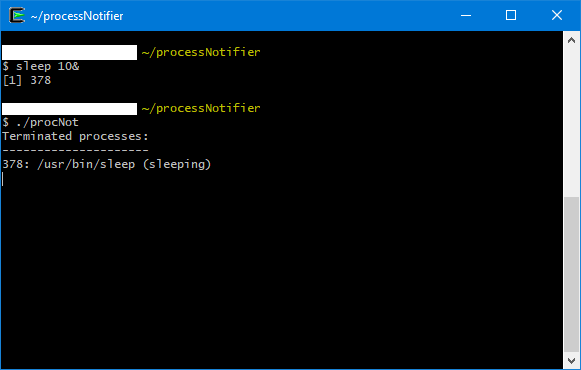

processNotifier (the executable named `procNot` to type less) - Linux console program notifying about creation and termination of processes.
Polls the `proc` pseudo-filesystem. Stopped by `^C`.

Created: March 25, 2019

Usage example:

```shell
$ sleep 10&
$ ./procNot
```

Output:


